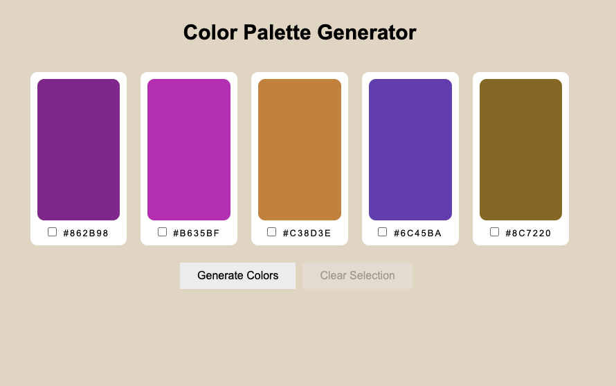
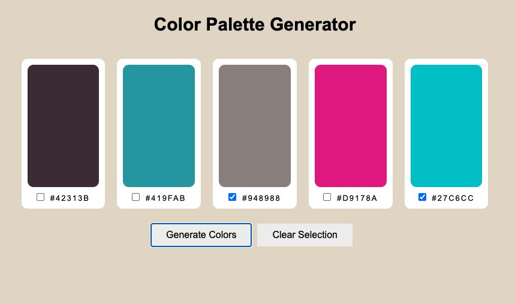
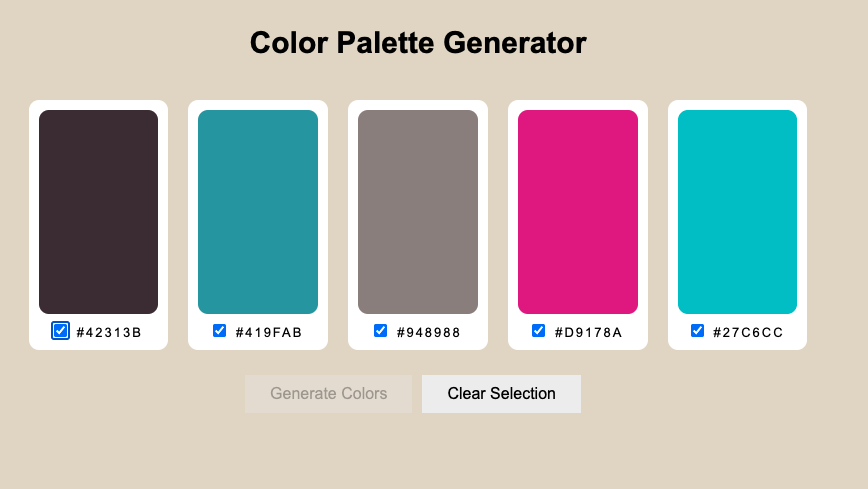

# Assignment - Color Palette Generator

In this assignment, you will code a basic React color palette generator.

## Objectives

- Implement a functioning UI with React components.
- Implement state.
- Handle events through callback props.
- Undertstand how to build a basic React app.

## Instructions

### Project setup

Clone this repository to your local machine and then run the following in a terminal within the root of your project.

```bash
npm install
```

Next run the following to start the development server.

```bash
npm start
```

### Create a React color palette generator

Using the included code as a starting point, implement a random color palette generator using React. A sample of the completed user interface in its initial state is show below.



When the user initially lands on the page, a series of five randomly generated colors, along with their corresponding hexadecimal value is displayed. The user may choose to generate an entirely new color palette of five colors by clicking the _Generate Colors_ button. Notice that the _Clear Selection_ button is disabled when no colors are selected.

If the user wishes to preserve any of the colors in the palette and prevent them from being replaced the next time colors are generated, they may click the checkbox on the corresponding color card.



In the example above, 2 colors are selected and will be preserved, while the other three colors will be replaced (when colors are generated). Also notice that the _Clear Selection_ button is now enabled. When this button is clicked, all selections should be deselected, and the button disabled again.

Finally, if a user selects all colors to be preserved, the \*Generate Colors" button should be disabled.



### Requirements

You must implement the following React components:

- App - overall applications
- ColorCard - contains the color box and hexadecimal code for a generated color.
- Palette - Contains the collection of ColorCard

In addition, you should implement a module named _generateRandomColor_ function which is placed in its own module and imported where needed in your components. The function should return a randomly generated hexadecimal string representing a valid CSS color. Each string should be 6 hexadecimal characters long and should be padded with a _#_. For example "#AF12BC".

Finally, your app must implmenet the following functionality as described above:

- Display 5 random colors on initial page landing.
- Allow user to generate a new set of random colors.
- Select colors to preserve.
- Clear selection of preserved colors.

The UI does not need to match the samples given exactly, but you should try and implement as close as possible.

## Submitting your assignment

Before submitting, make sure you have staged and then committed all of your changes.

```bash
git add .
git commit -m 'Your commit message'
```

Next tag your repository and push to GitHub.

```bash
git tag -a final -m 'Grade Me'
git push --follow-tags
```
